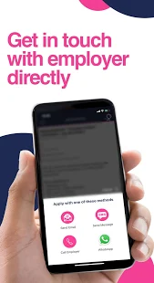
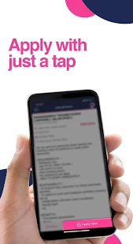
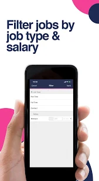
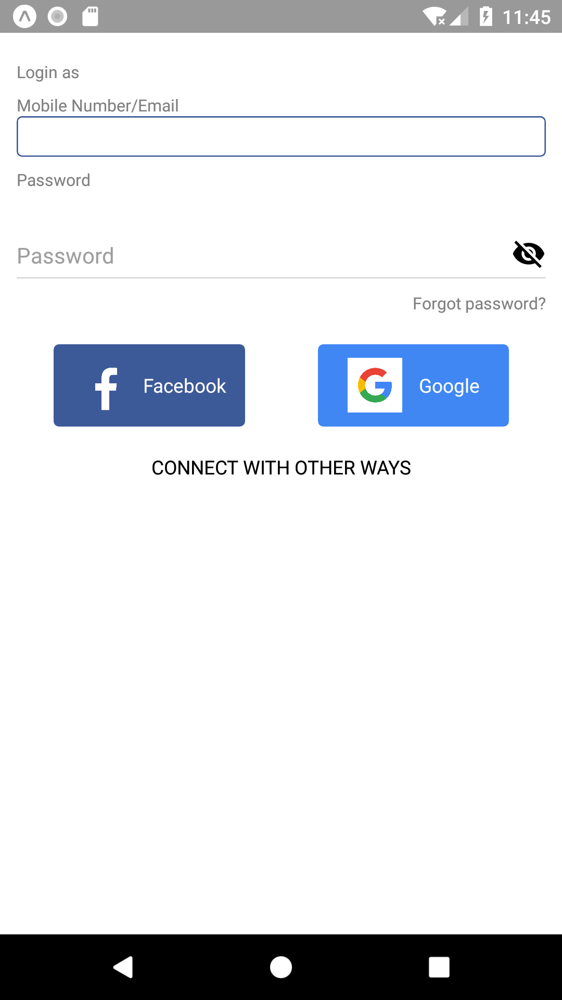
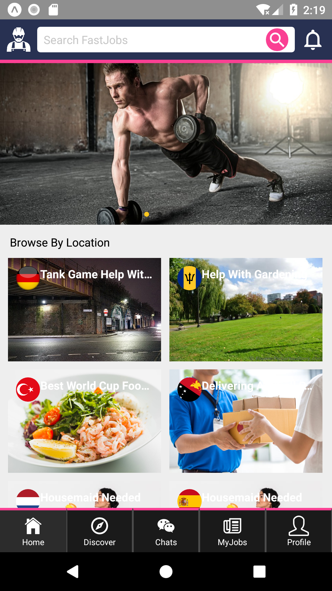

<h1 align="center"><b> Job Portal App</b> </h1>

Have a truck and ready to take a load.? Log into your carrier app and go straight to the load board.!

<i>"How to save a life?" - The Job Portal</i> 

  
  
  
  

  <a href="#blush-overview">Overview</a> •
  <a href="#dizzy-roadmap">Roadmap</a> •
  <a href="#wrench-install-instructions">Install</a> •
  <a href="#zap-tech-stack">Tech Stack</a> •
  <a href="#iphone-Test">Test</a> •
  <a href="#eyes-version">Version</a> •

  <kbd>
    
  </kbd>
  &nbsp;&nbsp;&nbsp;&nbsp;
  <kbd>
    
  </kbd>
  &nbsp;&nbsp;&nbsp;&nbsp;
  <kbd>
    
  </kbd>
    
  <kbd>
    
  </kbd>
    &nbsp;&nbsp;&nbsp;&nbsp;
  <kbd>
    
  </kbd>
    &nbsp;&nbsp;&nbsp;&nbsp;
  <kbd>
    
  </kbd>

## :blush: **Overview?**

Looking for a job in Asia? Simplify your job search and find work in Asia at your fingertips. Act fast and browse thousands of classifieds jobs, part-time jobs, temporary jobs, contract jobs, freelance work, and holiday jobs on FastJobs. You can be a student looking for part-time work, a mum looking to work from home or just looking for a change in career, FastJobs has plenty of job opportunities available. With constantly updated job vacancies, getting employment in Asia can be simple and direct.

Customise your profile and apply for your preferred job - in just 3 simple steps:

1. Register for a free account with your basic particulars and skillsets - ditch the hassle of uploading a detailed resume on job websites.

2. Search for jobs you have in mind, and filter your preferences by salary, locations, job functions (such as admin jobs, logistics work or accounting jobs), job industries (such as banking, retail or hotel) and job type (Full Time, Part Time etc) - with just a few swipes.

3. Call, SMS or email to apply for the job directly to the employer with 1-tap, or save it for later. 

Cool, you're done! Good luck!

The FastJobs team would like to thank you very much for your support and we deeply appreciate your feedback since we launched. Your feedback has contributed to our updates and improvements, and we will continue to improve FastJobs. Please continue to support us and keep a lookout for the improvements.

## :dizzy: **Roadmap**

-   [x] Make it work on IOS
-   [x] Make it work on Android
-   [x] Make it work on Expo
-   [x] Transform into responsive
-   [x] Update to latest React Native version

## :wrench: **Install instructions**

### Getting Started

#### 1) Clone & Install Dependencies

- 1.1) `git clone https://github.com/kingofdevs/rn-fastjobs.git`
- 1.2) `cd rn-fastjobs` - cd into your newly created project directory.
- 1.3) Install NPM packages with `yarn install`
        **Note:** NPM has issues with React Native so `yarn` is recommended over `npm`.
#### 2) Start your app

- 2.1) **[EXPO]** Build and run the iOS app, run `expo run-ios` (to run on simulator) or `expo --device` (to run on real device) from the root of your project. The first build will take some time.
## :zap: **Tech Stack**

<h1 align="center">
  
  
  
  
   
</h1>

-   [React Native](https://github.com/facebook/react-native)
-   [Expo](https://github.com/expo/expo)
-   [Redux](https://github.com/reduxjs/react-redux)
-   [Redux-Persist](https://github.com/rt2zz/redux-persist)
-   [Antd Mobile RN](https://github.com/ant-design/ant-design-mobile-rn)
-   [React Native Firebase](https://github.com/invertase/react-native-firebase)
-   [Eslint](https://eslint.org/)

## :iphone: **Test**

- [x] Test on Android
- [x] Test on iOS

## :eyes: **Version**
- [ ] React-Native 
- [x] Expo 36
